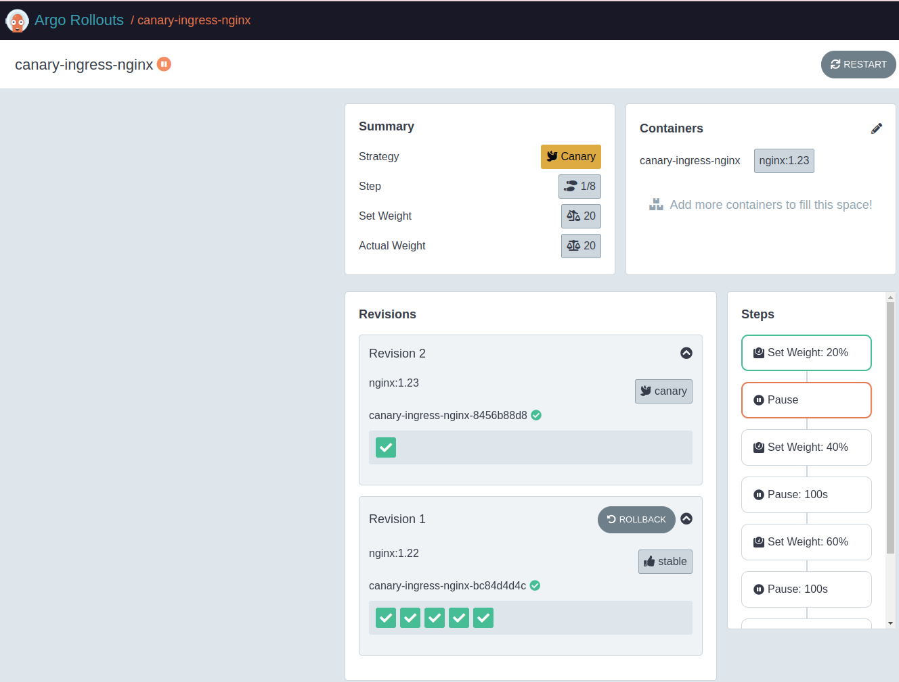
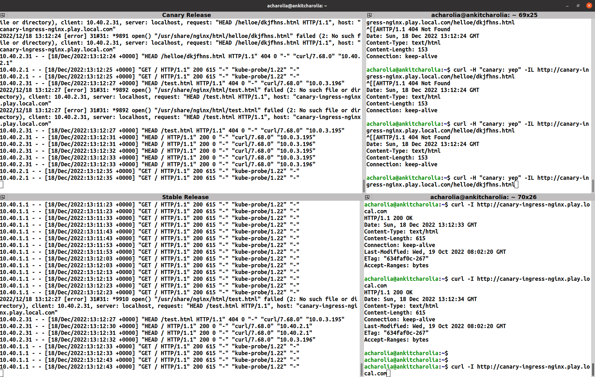

# Argo-Rollout Traffic Management with Ingress Nginx

```shell
helm upgrade --install nginx traffic-mgmt-ingress-nginx
```

- change the image tag from 1.22 to 1.23 and upgrade helm deployment again.

- check the logs of stable and canary deployments


```shell
# curl with header info
curl -H "canary: yep" -IL http://canary-ingress-nginx.play.local.com/helloe/dkjfhns.html

# curl without header info
curl -I http://canary-ingress-nginx.play.local.com/test.html
```

## Screenshots




